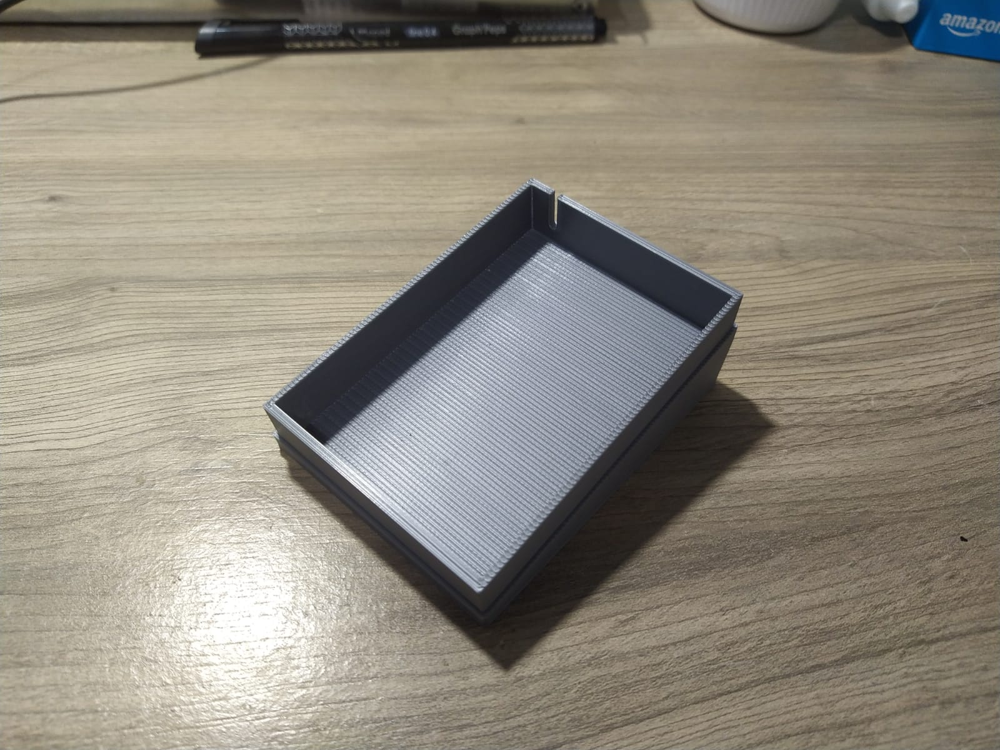
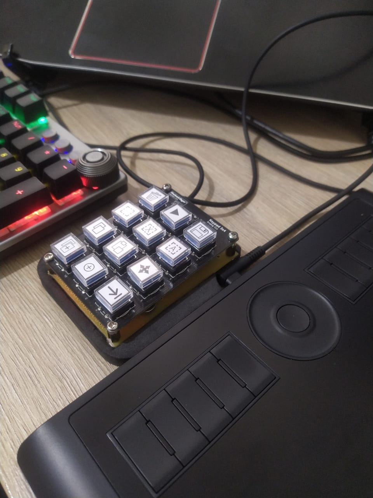

# HotKeyPad

Arduino based hot keys programmable mini keyboard.

Arduino **Mega32U4** based.

# 

# Serial commands

* Ack 
  - Command = A
* Set a command 
  - Command = S\<pos\>\<command\>
  - pos = 48 to 59 (11 buttons, ASCII {0,1,2,3,4,5,6,7,8,9,:,;})
* Read command list 
  - command = R
* Clear memmory 
  - command = C

# Command format

```
<mode><hold time><delay time><ctrl><alt><shift><gui>[<key list>]
```

* mode:
  * 48 = hold (press all keys)
  * 49 = sequence (press keys in sequence)
* hold time:
  * Time holding the key, (t * 100)ms (modifiers not included) 
  * only on sequence mode
* delay time:
  * Time between the keys, (t * 100)ms (modifiers not included) 
  * only on sequence mode
* crtl, alt, shift, and gui (modifiers)
  * 48 = not pressed
  * 49 = pressed
* key list
  * Key sequence (ASCII code)
  * In hold mode pressed all at the same time, and released when the button it's released.
  * In sequence mode press and release using hold and delay times.

## Control Keys

| KEY HEXADECIMAL | VALUE | DECIMAL VALUE |
| --------------- | ----- | ------------- |
| KEY_LEFT_CTRL   | 0x80  | 128           |
| KEY_LEFT_SHIFT  | 0x81  | 129           |
| KEY_LEFT_ALT    | 0x82  | 130           |
| KEY_LEFT_GUI    | 0x83  | 131           |
| KEY_RIGHT_CTRL  | 0x84  | 132           |
| KEY_RIGHT_SHIFT | 0x85  | 133           |
| KEY_RIGHT_ALT   | 0x86  | 134           |
| KEY_RIGHT_GUI   | 0x87  | 135           |
| KEY_UP_ARROW    | 0xDA  | 218           |
| KEY_DOWN_ARROW  | 0xD9  | 217           |
| KEY_LEFT_ARROW  | 0xD8  | 216           |
| KEY_RIGHT_ARROW | 0xD7  | 215           |
| KEY_BACKSPACE   | 0xB2  | 178           |
| KEY_TAB         | 0xB3  | 179           |
| KEY_RETURN      | 0xB0  | 176           |
| KEY_ESC         | 0xB1  | 177           |
| KEY_INSERT      | 0xD1  | 209           |
| KEY_DELETE      | 0xD4  | 212           |
| KEY_PAGE_UP     | 0xD3  | 211           |
| KEY_PAGE_DOWN   | 0xD6  | 214           |
| KEY_HOME        | 0xD2  | 210           |
| KEY_END         | 0xD5  | 213           |
| KEY_CAPS_LOCK   | 0xC1  | 193           |
| KEY_F1          | 0xC2  | 194           |
| KEY_F2          | 0xC3  | 195           |
| KEY_F3          | 0xC4  | 196           |
| KEY_F4          | 0xC5  | 197           |
| KEY_F5          | 0xC6  | 198           |
| KEY_F6          | 0xC7  | 199           |
| KEY_F7          | 0xC8  | 200           |
| KEY_F8          | 0xC9  | 201           |
| KEY_F9          | 0xCA  | 202           |
| KEY_F10         | 0xCB  | 203           |
| KEY_F11         | 0xCC  | 204           |
| KEY_F12         | 0xCD  | 205           |
| KEY_F13         | 0xF0  | 240           |
| KEY_F14         | 0xF1  | 241           |
| KEY_F15         | 0xF2  | 242           |
| KEY_F16         | 0xF3  | 243           |
| KEY_F17         | 0xF4  | 244           |
| KEY_F18         | 0xF5  | 245           |
| KEY_F19         | 0xF6  | 246           |
| KEY_F20         | 0xF7  | 247           |
| KEY_F21         | 0xF8  | 248           |
| KEY_F22         | 0xF9  | 249           |
| KEY_F23         | 0xFA  | 250           |
| KEY_F24         | 0xFB  | 251           |

# Program


1. This field indicates the connected device and the port;
2. Presets:
   * Here you can save presets, when a preset it's applied, the memory of the device it's cleared and all the commands of the preset it's loaded to the device;
3. The buttons of the device, you can select they to alter it's configurations;
4. Button configuration you can set what a button will do here:
   * Mode:
     - hold, all buttons will be pressed at the same time;
     - sequence, the button will be pressed in sequence following the configured 'hold time' and 'delay time' (time to wait before press the next button);
   * Modifiers: 
     - Control, alt, Shift, and Gui (win key on windows);
   * Command:
     - Just press a key to set, and use backspace to remove a key
     - To add a especial key/command use the list bellow.
   * Save: 
     - Remember to save to record the command on the device.
5. Controls:
   * Clear Device:
     - Clear device memory;
     - Reload commands from the connected device;
     - Minimize to tray;

# Presets

* Presets are saved on `<Your Document Folder>\HotKeyPad` on '*json*' format.
* You can export presets copying them from this folder.
* You can import presets adding them to this folder.


# Casing (3D printed) Version 2.0 - Using switches

[Model on Thingiverse](https://www.thingiverse.com/thing:6915041)


# Base Circuit 2.0


# Material List 2.0

- Arduino Pro Micro (Mega32U4):
  
  - [Aliexpress: Arduino pro micro](https://s.click.aliexpress.com/e/_oDuboil);

- Keypad:
  
  - 12 keyboard switchs;
    - [Aliexpress Switches](https://s.click.aliexpress.com/e/_oD1yDoz)
  - 12 Keycaps (can be printed, files included)
  - 12 3mm leds
  - 24 Stamped contacts (removed from commom stamped IC sockets)
    - [Aliexpress stamped sockets](https://s.click.aliexpress.com/e/_oBNMCW9)

- Wires for assembly;

- Soldering wire;

- USB cable;

- 4 M3 Bolts;

- 4 M3 Nuts;

- A good soldering iron;

- Patience;
  
   

# 

# Base Circuit 1.0


- Vibration cell optional.
- Keyboard can be of any kind, only need to update '*readButton*' method on Arduino code (*\Arduino\HotKeyPad\HotKeyPad.ino*)

# Casing (3D printed) Version 1.0 - Using resistive 3x4 Keypad

[Model on Thingiverse](https://www.thingiverse.com/thing:5168905)





# Material List 1.0

* Arduino Pro Micro (Mega32U4):
  
  - [Aliexpress: Arduino pro micro](https://s.click.aliexpress.com/e/_oDuboil);

* Keypad:
  
  - Can be of any kind, or with some soldering skills you can use mechanical keyboard switchs;
  - [Aliexpress: mechanical switchs](https://s.click.aliexpress.com/e/_oD1yDoz);
  - [Aliexpress: Relegendable Keycaps](https://s.click.aliexpress.com/e/_om7lIPf);

* Optional vibration motor (Vibration cell)
  
  - [Aliexpress: Vibration motor](https://s.click.aliexpress.com/e/_oo2dn4d);

* PCB
  
  - In the example I used prototype PCB, but you can make your own;

* 3 pin female PCB connector

* Wires for assembly;

* Soldering wire;

* Micro USB cable;

* Some bolts and spacers;
  
  - [Aliexpress: Spacers](https://s.click.aliexpress.com/e/_oFxN3eD);

* A good soldering iron;

* Patience;


# Prototype (version 0.1)


